# Ninja 项目概要文档

基于 [README.md](https://github.com/is-leeroy-jenkins/Ninja)、源码结构与公开资料整理。Ninja 是一款面向 Windows 的 **.NET 8 + WPF** 开源网络管理与排障工具（作者 Terry Eppler，仓库 [is-leeroy-jenkins/Ninja](https://github.com/is-leeroy-jenkins/Ninja)）。

---

## 一、5W2H 分析

| 维度                      | 说明                                                         |
| ------------------------- | ------------------------------------------------------------ |
| **What（是什么）**        | 一体化桌面工具：远程连接（RDP、PowerShell、PuTTY、TigerVNC、AWS Session Manager、WebConsole）+ 网络诊断（WiFi、IP/端口扫描、Ping、Traceroute、DNS、SNMP、LLDP/CDP、Whois、子网计算等），统一界面与可加密的主机/网络 **Profile**。 |
| **Why（为什么做）**       | 把分散的 mstsc、putty、ping、nslookup 等工具收敛到一个界面，用 Profile 跨功能复用主机信息，降低日常运维与排障切换成本。 |
| **Who（谁用）**           | 网络/系统管理员、运维工程师、桌面支持、需要本地排障的 IT 人员。 |
| **When（何时用）**        | 日常巡检、故障定位、远程维护、资产发现、连通性验证、交换机邻居发现等场景。 |
| **Where（运行环境）**     | Windows 10+（`net8.0-windows10.0.17763.0`），VS 2022 构建；支持 AnyCPU / x86 / x64；可选便携模式（配置与 Profile 跟 exe 走）。 |
| **How（怎么做）**         | 经典 WPF MVVM + 多类库分层；**无 DI 容器**，用 `SettingsManager`、`ProfileManager` 等静态管理器；网络逻辑在 `Ninja.Models`，UI 在 `Ninja`；远程会话通过嵌入外部进程或 ActiveX。 |
| **How much（规模/成本）** | 解决方案约 **12 个项目**；`Ninja/ViewModels` 约 **100+** ViewModel；`ApplicationName` 枚举 **20+** 功能模块；MIT 许可；可选联网服务（GitHub 更新检查、ipify、ip-api）需用户显式开启。 |

---

## 二、解决方案与模块职责

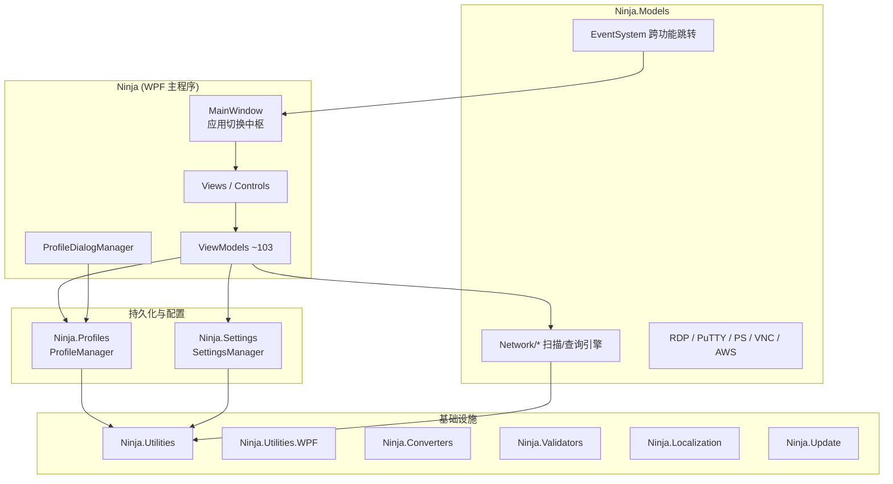

| 项目                                                         | 职责                                                         |
| ------------------------------------------------------------ | ------------------------------------------------------------ |
| **Ninja**                                                    | 主壳层：`App`、`MainWindow`、Views、ViewModels、嵌入式会话控件 |
| **Ninja.Models**                                             | 网络引擎、会话模型、`ApplicationName`、`EventSystem`         |
| **Ninja.Profiles**                                           | `ProfileInfo` / `GroupInfo`、`ProfileManager`、各应用 `CreateSessionInfo` |
| **Ninja.Settings**                                           | 全局设置 XML、`ConfigurationManager`                         |
| **Ninja.Utilities**                                          | `PropertyChangedBase`、`RelayCommand`、`CryptoHelper`、剪贴板等 |
| **Ninja.Controls / Converters / Validators / Localization / Update** | 控件库、绑定转换、校验、多语言、更新                         |

---

## 三、技术实现要点

### 3.1 启动与生命周期

```25:36:Ninja/App.xaml.cs
    /*
     * Class: App
     * 1) Get command line args
     * 2) Detect current configuration
     * 3) Get assembly info
     * 4) Load settings
     * 5) Load localization / language
     *
     * Class: MainWindow
     * 6) Load appearance
     * 7) Load profiles
     */
```

启动链：`SettingsManager.Load()` → 本地化 → 单实例 Mutex → 可选后台定时保存 → `MainWindow`；退出时 `SettingsManager.Save()` + `ProfileManager.Save()`。

### 3.2 MVVM 约定（每个功能一套）

| 层级                     | 命名                                                       | 示例                           |
| ------------------------ | ---------------------------------------------------------- | ------------------------------ |
| 宿主（Profile + 多 Tab） | `{Feature}HostView` + `*HostViewModel` + `IProfileManager` | `PortScannerHostViewModel`     |
| 工作区                   | `{Feature}View` + `*ViewModel`                             | `PortScannerViewModel`         |
| 设置                     | `{Feature}SettingsView` + `*SettingsViewModel`             | `PortScannerSettingsViewModel` |

基类继承：`PropertyChangedBase` → `ViewModelBase`。

### 3.3 Profile 与加密

- 存储：`Documents\{AppName}\Profiles\` 或便携目录下的 `*.xml` / `*.encrypted`
- 序列化：`XmlSerializer` → `GroupInfoSerializable` / `ProfileInfoSerializable`
- 加密：AES-CBC + PBKDF2（SHA-512，可配置迭代次数），见 `CryptoHelper`

### 3.4 远程连接实现

| 工具                        | 实现方式                      |
| --------------------------- | ----------------------------- |
| RDP                         | `AxMSTSCLib` ActiveX 嵌入 WPF |
| PuTTY / PowerShell          | 启动外部进程，Win32 嵌入 HWND |
| TigerVNC / WebConsole / AWS | 专用 `*Control` 宿主          |

Profile 合并优先级：**Profile 字段 → Group 覆盖 → `SettingsManager` 默认值**（`Ninja.Profiles.Application.*`）。

### 3.5 网络功能实现模式

**模式 A（主流）**：`Ninja.Models.Network.*` 引擎发布事件 → ViewModel 订阅 → `Dispatcher` 更新 `ObservableCollection` → 可选 `ExportManager` 导出。

**模式 B**：Host + Dragablz 多 Tab，每个目标一个 `*ViewModel`。

**模式 C**：直接调用 .NET API（如 `Ping`、`TcpClient`）或第三方库（如 DnsClient.NET、SharpSNMP）。

---

## 四、架构设计图（逻辑分层）

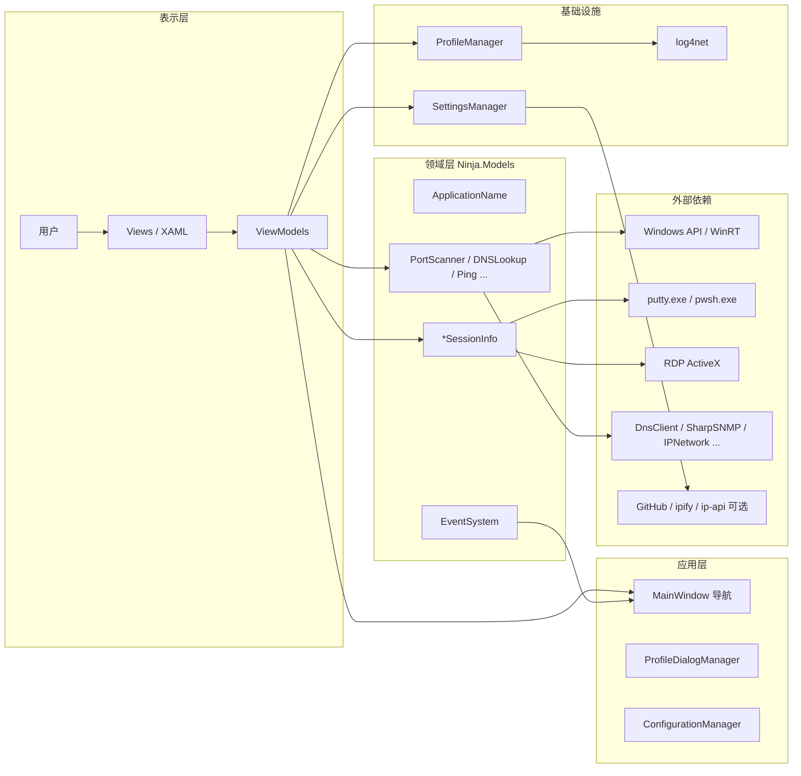

---

## 五、核心业务流

### 5.1 应用冷启动

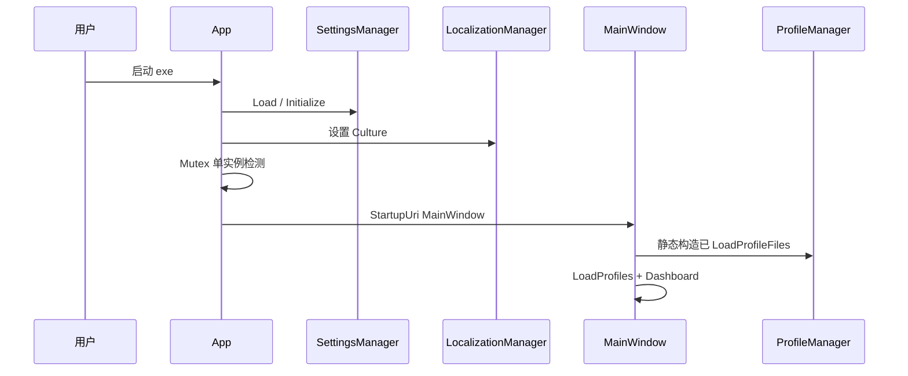

### 5.2 加密 Profile 解锁并切换

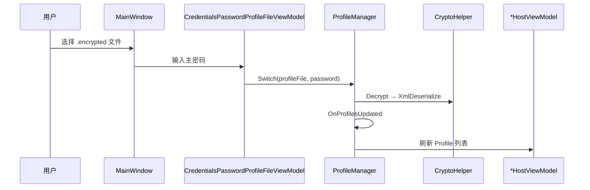

### 5.3 端口扫描（典型网络诊断流）

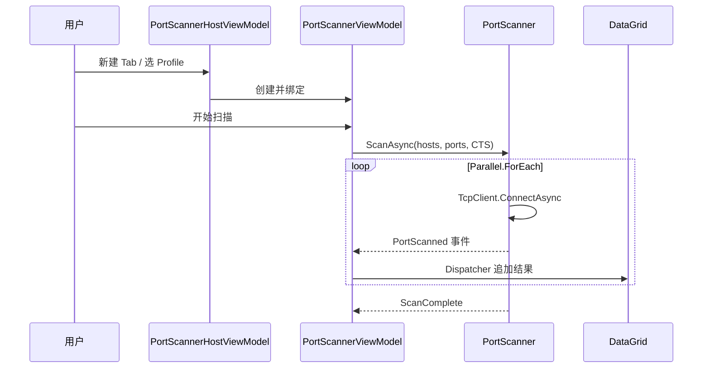

### 5.4 从 Profile 连接 RDP

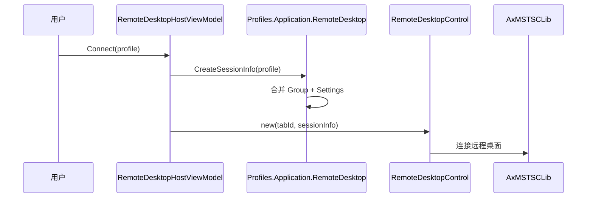

### 5.5 跨功能跳转（EventSystem）

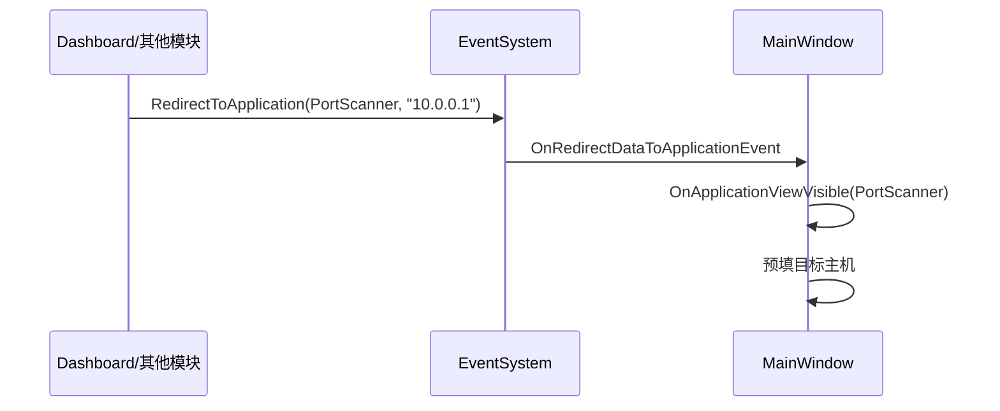

---

## 六、数据流

### 6.1 配置与 Profile 持久化

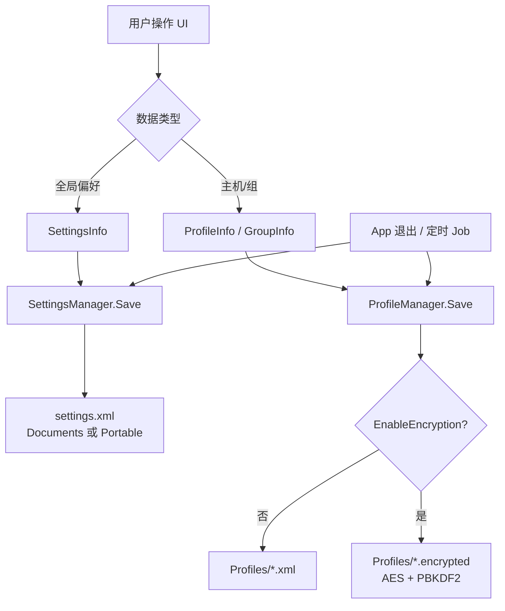

### 6.2 扫描类功能运行时数据流

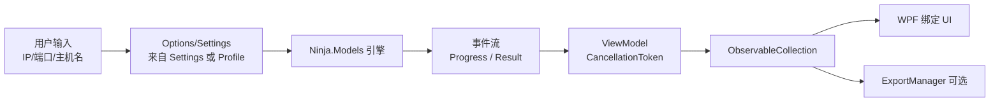

### 6.3 远程会话数据流

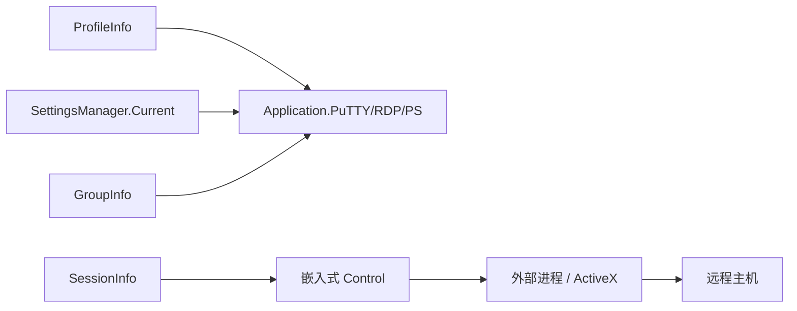

---

## 七、重要类图

### 7.1 ViewModel 继承与 Profile 接口

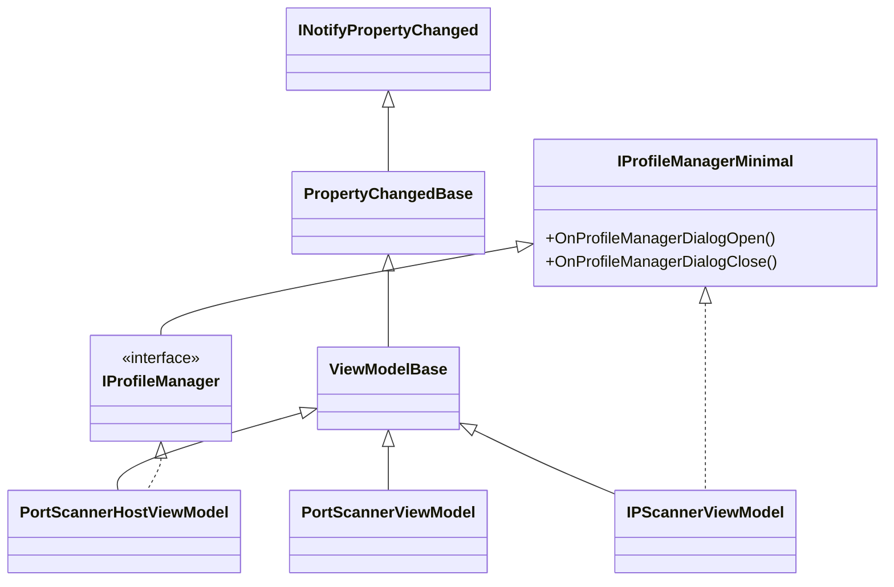

### 7.2 Profile 领域模型

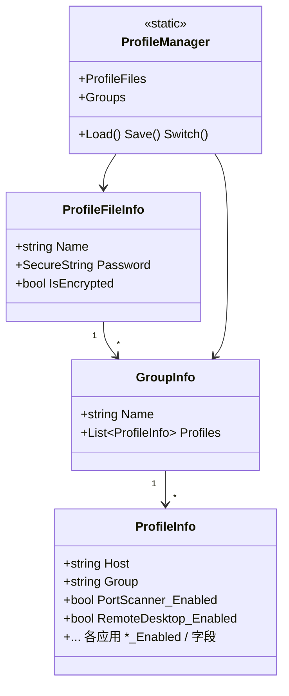

### 7.3 网络扫描引擎（以 PortScanner 为例）

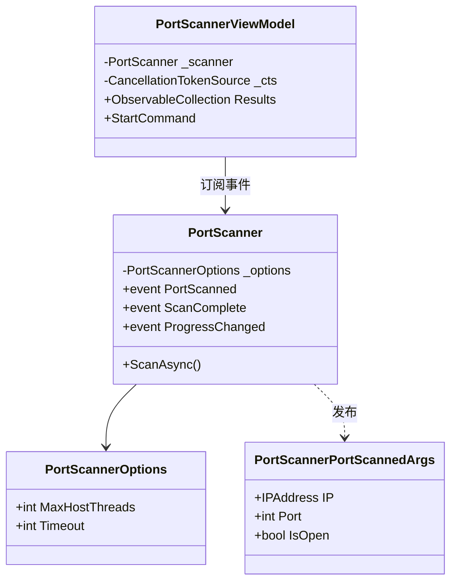

### 7.4 应用注册与导航

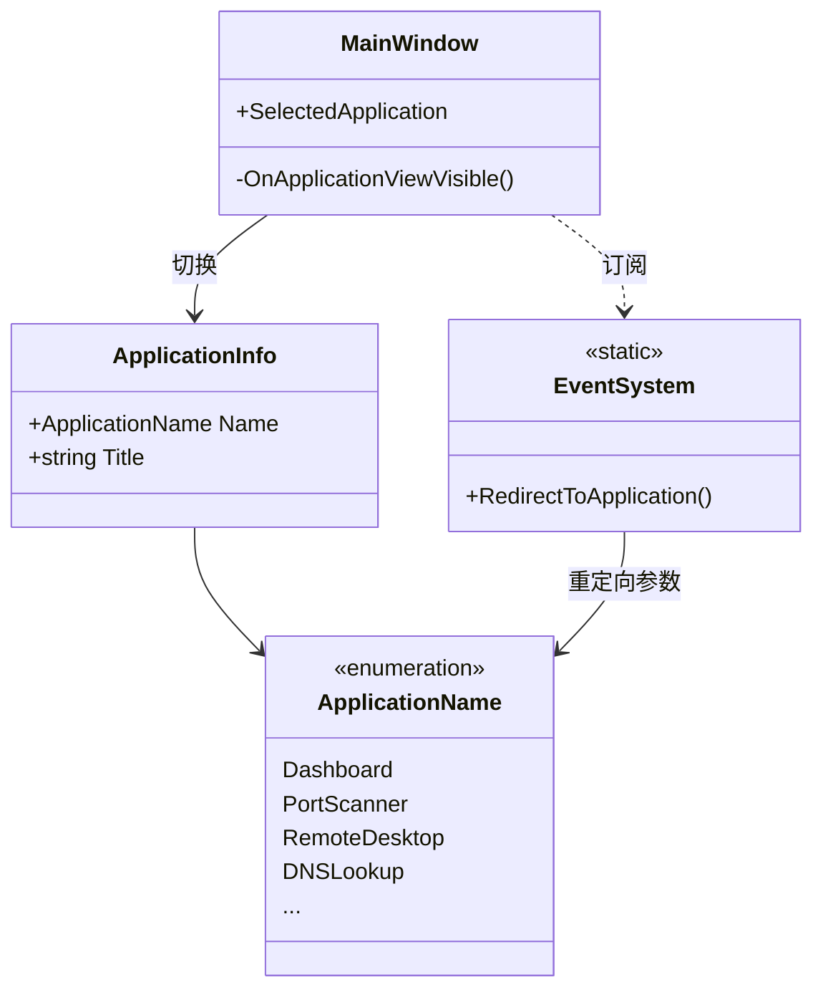

### 7.5 远程会话映射（Profile → Session）

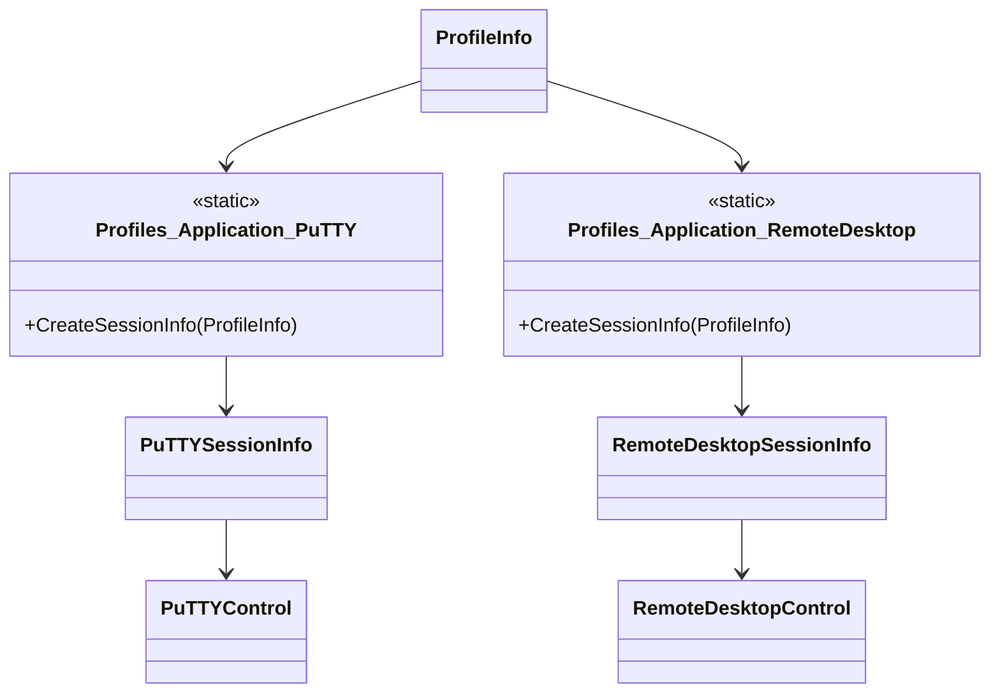

---

## 八、功能清单（`ApplicationName`）

| 类别      | 功能                                                         |
| --------- | ------------------------------------------------------------ |
| 总览      | Dashboard                                                    |
| 本地网络  | NetworkInterface、WiFi、Connections、Listeners、ARPTable     |
| 诊断扫描  | IPScanner、PortScanner、PingMonitor、Traceroute              |
| 查询/协议 | DNSLookup、SNMP、SNTPLookup、DiscoveryProtocol、Whois、WakeOnLAN |
| 远程连接  | RemoteDesktop、PowerShell、PuTTY、TigerVNC、AWSSessionManager、WebConsole |
| 工具      | IPGeolocation、SubnetCalculator、BitCalculator、Lookup       |

---

## 九、主要第三方依赖（README 摘录）

SharpSNMP、DnsClient.NET、IPNetwork、MahApps.Metro、Dragablz、PSDiscoveryProtocol（LLDP/CDP）等；构建与签名通过 AppVeyor + SignPath。

---

## 十、总结

Ninja 采用 **“单壳多工具 + 静态管理器 + 事件驱动引擎”** 架构，而不是现代 DI/微服务风格。价值集中在：

1. **统一入口**：`MainWindow` + `ApplicationName` 切换 20+ 工具  
2. **Profile 中枢**：`ProfileInfo` 上的 `*_Enabled` 与各应用字段，跨功能复用主机与凭据  
3. **清晰分层**：UI（ViewModel）与网络/远程逻辑（Models）分离，便于维护单个扫描器  
4. **可扩展模式**：新功能 = 新枚举值 + Host/View/Settings 三件套 + 可选 `Ninja.Models` 引擎 + Profile 字段  

如需把本文落盘为 `docs/概要设计.md` 或导出 PDF 结构，可以说明格式偏好，我可以按同样结构写入仓库。